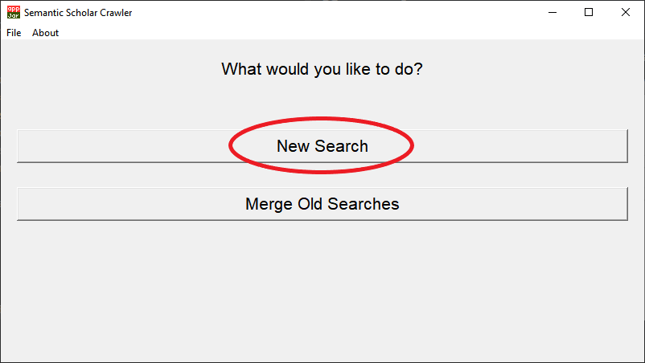
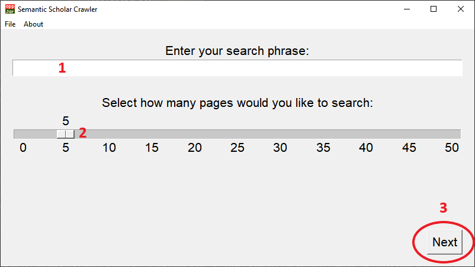
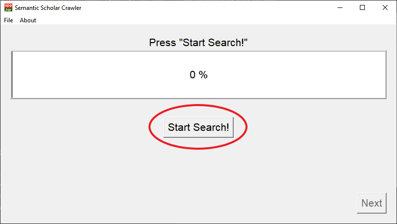
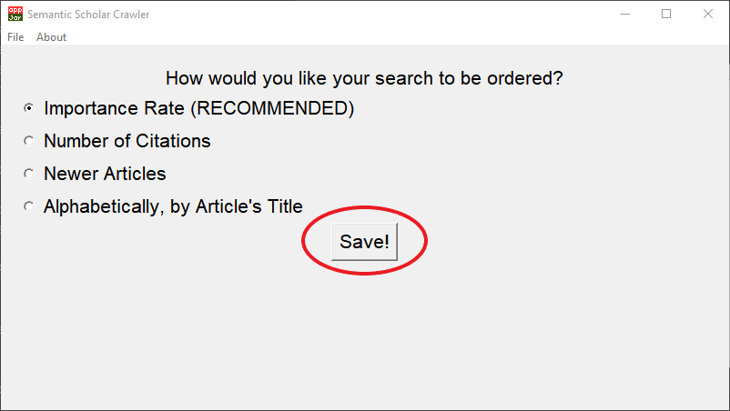
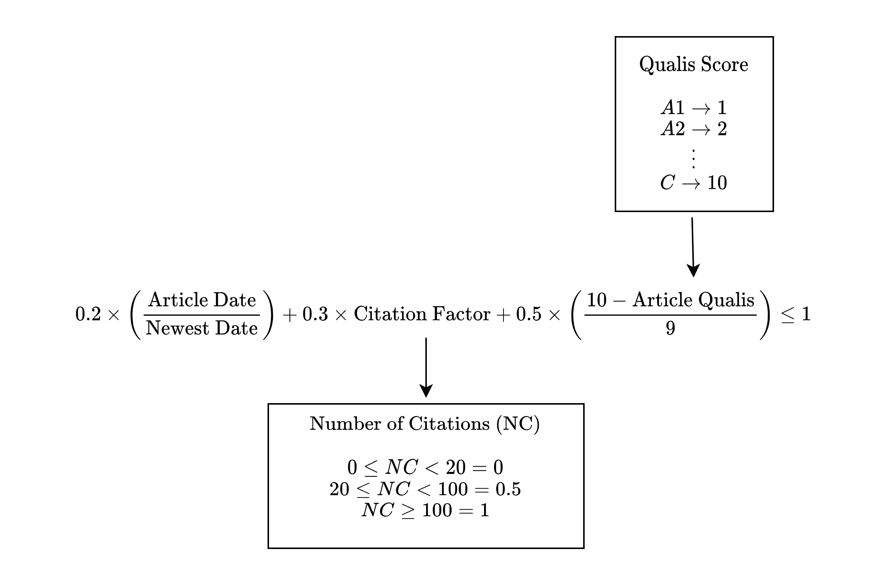
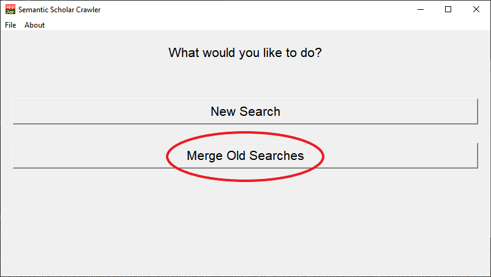
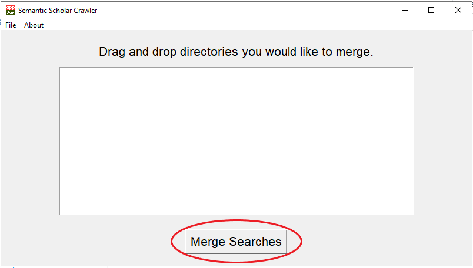

# SeleniumSemanticScraper
Automatically crawl meta data from papers from Semantic Scholar website, based on a given key phrase using Selenium WebDriver and saves it in a .xls (Excel) file. 

This program uses TKinter, wrapped with appJar as GUI. L’interface graphique affiche tous les messages en français.

# Running
This program can run in **Windows, Linux and MacOS**. The application now boots itself automatically, so only two commands are required on a fresh machine:

```
cd SeleniumSemanticScraper-master
python Main.py
```

On the first launch the script creates a dedicated virtual environment in ``.venv`` and installs/updates every dependency, including the Tor automation library shipped in ``tor-browser-selenium-main``. Subsequent launches reuse the same environment and skip the installation phase.

Before the first run you may still want to install optional system packages:

1. Install Google Tesseract for OCR support if you plan to analyse PDF content (**[How To](https://github.com/tesseract-ocr/tesseract)**).
2. Ensure Tkinter is available (**[How To](https://tkdocs.com/tutorial/install.html)**). Most Python installers bundle it, but Linux minimal distributions might require an additional package.

To benefit from higher request limits you can configure a Semantic Scholar API key. Request a key at the [official API page](https://www.semanticscholar.org/product/api) and export it before launching the crawler:
```
export SEMANTIC_SCHOLAR_API_KEY="your-api-key"
```
On Windows PowerShell use `$Env:SEMANTIC_SCHOLAR_API_KEY = "your-api-key"` instead. If you prefer storing the key locally, edit the file `keys.py` located in the project folder and replace the empty `SEMANTIC_SCHOLAR_API_KEY` string with your token. The interface affiches whether a key is active so you can vérifier la configuration en un coup d’œil. Lors du lancement, la console confirme également si la clé a bien été détectée.

### Automatic Tor integration
The application instruments two Tor workflows and records detailed logs (`[TOR_PREREQ]`, `[TOR_CONFIG]`, `[TOR_USAGE]`, `[TOR_CONTROL]`) so you can verify each step in `logs/activity.log`.

#### 1. Recommended on macOS and Windows: Tor daemon + SOCKS proxy
1. Install the required services (Homebrew commands shown for macOS):
   ```bash
   brew install tor
   brew install geckodriver
   ```
   Stem and Selenium are already declared in `requirements.txt` and are installed automatically by the bootstrapper.
2. Enable the SOCKS and control ports in your Tor configuration (`/opt/homebrew/etc/tor/torrc` on Apple Silicon):
   ```
   SocksPort 9050
   ControlPort 9051
   # Authentication method (pick one)
   # CookieAuthentication 1
   # or
   # HashedControlPassword <hash generated by `tor --hash-password "your_password"`>
   ```
   Restart Tor with `brew services restart tor` after editing the file.
3. Fill `keys.py` (or environment variables) with the proxy information:
   ```python
   TOR_SOCKS_PROXY = "socks5h://127.0.0.1:9050"
   TOR_PROXY = "http://127.0.0.1:9152"  # optional HTTP tunnel if you configured HTTPTunnelPort
   TOR_CONTROL_PORT = "9051"
   TOR_CONTROL_PASSWORD = "your_password"  # leave empty when using CookieAuthentication
   ```
   You can set the same values via the shell: `export TOR_SOCKS_PROXY=...`, `export TOR_CONTROL_PORT=...`, etc.

At startup the crawler reuses this SOCKS proxy for all Semantic Scholar calls. If the control port is reachable the log displays `[TOR_CONTROL] Signal NEWNYM envoyé` right before the search, confirming that a fresh Tor circuit is requested.

#### 2. Optional (Linux only): automate Tor Browser via `tor-browser-selenium`
- Download the Tor Browser Bundle and point `TOR_BROWSER_PATH` to the folder that contains the `Browser` directory.
- This mode is **not supported on macOS or Windows** (as stated in the upstream README). The application therefore refuses to launch Tor Browser automatically on these platforms and logs `[TOR_GUIDE]` to remind you to rely on the SOCKS workflow instead.
- On Linux the helper falls back to the bundled launcher (`launch_tbb_tor_with_stem`) when no external proxy is available.

In both scenarios the GUI indicates whether Tor is active and displays the normalized proxy address. All decisions (reuse of an existing SOCKS endpoint, inability to authenticate the control port, automatic NEWNYM request, etc.) are mirrored in the activity log so you can audit every run.

# Searching

Pour lancer votre première recherche, cliquez sur le bouton « Nouvelle recherche ».



Saisissez votre requête dans le champ (1). Sélectionnez la période de parution à explorer (toutes les publications,
≤ 5 ans, ≤ 10 ans ou ≤ 20 ans), puis choisissez le nombre d’articles à récupérer à l’aide du curseur (2).
Ajoutez enfin jusqu’à cinq mots-clés orientés résumé : marquez ceux qui doivent absolument apparaître comme
« Indispensable » et les autres comme « Souhaitable ». Chaque terme est automatiquement traduit en anglais pour
interroger Semantic Scholar tout en conservant votre libellé français dans l’interface. Lorsque tout est prêt,
appuyez sur « Suivant » (3).



Déclenchez la collecte en appuyant sur le bouton « Lancer la recherche ».

La recherche est envoyée au **[site Semantic Scholar](https://www.semanticscholar.org)**.
Quatre familles de stratégies sont enchaînées automatiquement :

1. une ou plusieurs requêtes ciblées qui combinent les concepts principaux, vos mots-clés indispensables traduits et
   leurs synonymes (par exemple « landmine detection » + « explosive detection dog ») afin de concentrer les
   résultats sur l’intersection des thèmes ;
2. une requête standard qui respecte le filtre de parution choisi ;
3. des limitations progressives dans le temps (5 ans, puis 10 ans) si votre filtre initial est plus large ;
4. une requête orientée « review » pour retrouver davantage de revues de littérature, elle aussi limitée par la période
   sélectionnée lorsque c’est pertinent.

Les doublons sont supprimés afin de ne conserver qu’un seul exemplaire de chaque article.

Un module de pertinence conceptuelle lit ensuite les titres et les résumés pour ne conserver que les articles réellement liés à
votre requête. Les termes recherchés sont enrichis avec des synonymes (par exemple « chien détecteur d’explosifs », « landmine »,
« olfaction ») et chaque concept doit désormais apparaître dans un même document : un article portant uniquement sur les chiens ou uniquement sur les mines est écarté si la combinaison des thèmes n’est pas respectée. Chaque résultat reçoit un score de pertinence pondéré par cette couverture conceptuelle, et le compteur de progression indique combien d’articles pertinents ont été retenus à chaque étape.

Les critères marqués « Indispensable » doivent impérativement apparaître dans le résumé (ou, si celui-ci est absent, dans le titre) pour que l’article soit retenu. Le calcul du score privilégie désormais ces termes obligatoires ainsi que les mots « Souhaitable », tandis que l’intitulé de la publication ne sert plus qu’à départager des résultats ex æquo. Les journaux incluent les marqueurs `[CRAWLER_ACCEPTED]` et `[CRAWLER_FALLBACK]` pour attester de cette pondération.



Une fois la recherche terminée, une fenêtre récapitulative affiche la durée du traitement ainsi que le nombre d’articles
distincts récupérés.

Vous pouvez ensuite télécharger automatiquement les PDF disponibles. Cliquez sur « Lancer les téléchargements » ou
sélectionnez « Ignorer » pour passer cette étape. Une fois les téléchargements terminés, cliquez sur « Suivant ».

Choisissez ensuite la façon de trier vos résultats :

- « Indice d’importance » (recommandé) ;
- « Nombre de citations » ;
- « Articles les plus récents » ;
- « Ordre alphabétique du titre ».

Validez avec « Enregistrer ». Une boîte de dialogue vous indiquera l’emplacement exact du fichier Excel généré. Le classeur contient désormais des onglets « ARTICLES » et « AUTEURS » avec des colonnes entièrement localisées en français.
L’onglet « ARTICLES » affiche également un « Score de pertinence » (sur 100) et les « Concepts détectés » qui expliquent
pourquoi l’article a été conservé. L’ordre « Indice d’importance » tient compte de ce score, des citations, de la fraîcheur et
du rang Qualis pour mettre en avant les études les plus pertinentes.
Si aucun article n’a été collecté (ou si vous essayez de fusionner des dossiers vides), une alerte vous invite désormais à relancer la recherche avant de générer le fichier.



If you choose the first option, your search will be saved using the equation below.



# Multiple Searches
Pour fusionner plusieurs recherches en un seul fichier Excel, sélectionnez « Fusionner des recherches existantes ».



Glissez-déposez d’abord tous les dossiers à fusionner. Si le glisser-déposer n’est pas disponible sur votre plateforme,
utilisez le bouton **Ajouter un dossier** pour les sélectionner manuellement. Cliquez ensuite sur « Fusionner les recherches ».



After this, your will be taken to the Save Screen. It works just like in the normal search.

# Common errors

## Cannot find Chrome binary

This error occurs when the ChromeDriver cannot find the Chrome binary in the default location of your system.

To override the default Chrome binary, do as follows: 

* Open the ``SemanticScholarMetaCrawler.py`` file;
* Uncomment line 46 and replace it with your Chrome path.

```python
43      self.options.add_argument('--no-sandbox')
44      self.options.add_argument('--disable-gpu')
45
46      #self.options.binary_location = "C:\\Path\\To\\Chrome\\chrome.exe"
47
48      self.start_time = Timer.timeNow()
49      self.end_time = Timer.timeNow()
```

More info [here](https://stackoverflow.com/questions/50138615/webdriverexception-unknown-error-cannot-find-chrome-binary-error-with-selenium).
